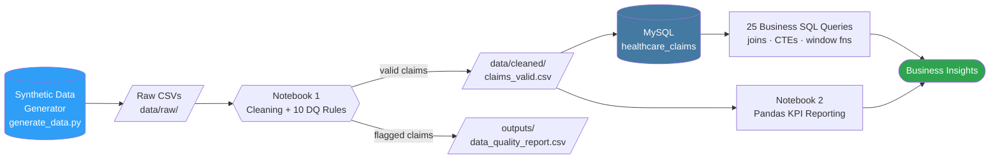
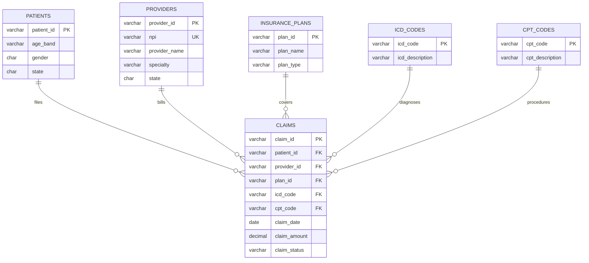

<div align="center">


<br/>


</div>

## What is this?

A **production-style, end-to-end healthcare claims analytics platform** built to
mirror the daily work of a Healthcare Data Analyst on a claims/reference-data
team — validating diagnosis (ICD) and procedure (CPT) codes, catching data
quality problems before they hit a report, and turning 10,000+ raw claims
into trustworthy business KPIs.

**100% synthetic data. Zero PHI. Zero PII.** Every patient record is anonymous
(surrogate ID + age band + gender + state only) — nothing that could identify
a real person, on purpose.

> Built as a portfolio project for healthcare data analyst / claims data
> engineering roles (e.g. Gainwell-style reference data + claims analytics
> work) using **only** Python, Pandas, MySQL, SQL, and Jupyter — no BI tools,
> no ML.


## Table of Contents

- [Architecture](#architecture)
- [The Pipeline in Numbers](#the-pipeline-in-numbers)
- [Business Problem](#business-problem)
- [Tech Stack](#tech-stack)
- [Project Structure](#project-structure)
- [Data Quality Engine](#data-quality-engine)
- [Database Design](#database-design)
- [SQL Analytics — 25 Business Queries](#sql-analytics--25-business-queries)
- [Sample Insights](#sample-insights)
- [How to Run It](#how-to-run-it)
- [Documentation](#documentation)
- [Future Improvements](#future-improvements)
- [Author](#author)


## Architecture



The pipeline is **deliberately split into two independent tracks**:

| Track | Tooling | Responsibility |
|---|---|---|
| 🐍 **Python track** | Pandas, Jupyter | Generate → clean → validate → flag → export |
| 🗄️ **SQL track** | MySQL | Schema → load → 25 business queries |

Python never queries MySQL and MySQL never runs Python — each track stands
on its own and is independently reviewable.


## The Pipeline in Numbers

<div align="center">

| Metric | Value |
|---|---|
| 📄 Raw claims generated | **10,060** |
| ✅ Claims passing all 10 DQ rules | **9,460** (94%) |
| 🚩 Claims flagged for review | **600** (6%, 60 per rule) |
| 🏥 Providers | **300** |
| 🙍 Patients (anonymous) | **2,500** |
| 💳 Insurance plans | **15** |
| 🩺 ICD-10 diagnosis codes | **150** |
| 🔬 CPT procedure codes | **113** |
| 💰 Total validated claim amount | **$3,672,696.57** |
| 📈 Overall approval rate | **61.97%** |
| 🗓️ Claim date range | **Jan 2023 – Dec 2025** |
| 🧮 Business SQL queries | **25** |

</div>


## Business Problem

A healthcare payer receives thousands of claims every month. Before any claim
can be trusted for reporting, reimbursement analysis, or compliance, it has to
survive a gauntlet of reference-data checks: is the diagnosis code real? Is
the procedure code real? Is the billing provider actually in network? Was
this claim already submitted once before?

This project builds that gauntlet — and then builds the reporting layer on
top of the claims that pass it.

Full requirements are documented in [`documentation/BRD.md`](BRD.md).


## Tech Stack

<div align="center">


</div>


## Project Structure

```
Healthcare-Claims-Analytics/
│
├── data/
│   ├── raw/                     # 6 generated CSVs (10,060 claims + dimensions)
│   └── cleaned/                 # load-ready: claims_valid.csv, claims_flagged.csv, dims
│
├── database/
│   ├── schema.sql                # tables, PKs, FKs, constraints, indexes, 2 views
│   └── load_data.sql             # LOAD DATA, FK-safe order
│
├── sql/
│   └── business_queries.sql      # 25 queries: joins, CTEs, window fns, ranking
│
├── python/
│   └── generate_data.py          # synthetic data generator (seeded, reproducible)
│
├── notebooks/
│   ├── 01_data_cleaning_and_validation.ipynb
│   └── 02_kpi_business_reporting.ipynb
│
├── outputs/
│   ├── data_quality_report.csv
│   └── kpi_summary.csv
│
├── documentation/
│   ├── README.md
│   ├── BRD.md
│   └── Data_Dictionary.md
│
├── screenshots/
├── requirements.txt
└── README.md
```


## Data Quality Engine

Ten independent business rules run against every claim. A claim can fail more
than one rule at once — nothing is silently dropped, everything is flagged
and reported.

<div align="center">

| # | Rule | Claims Flagged |
|---|---|:---:|
| 1 | Missing ICD code | 60 |
| 2 | Missing CPT code | 60 |
| 3 | Invalid ICD code (not in reference table) | 60 |
| 4 | Invalid CPT code (not in reference table) | 60 |
| 5 | Invalid provider ID | 60 |
| 6 | Missing insurance plan | 60 |
| 7 | Future-dated claim | 60 |
| 8 | Negative claim amount | 60 |
| 9 | Invalid claim status | 60 |
| 10 | Duplicate claim submission | 60 |

</div>

> Design principle: **cleaning ≠ validation.** Cleaning fixes technical
> formatting (whitespace, dtypes, exact duplicate rows). Validation applies
> business rules and *reports* violations — a real claims ops team needs to
> see the problem, not have it disappear.


## Database Design



Full column-level definitions live in
[`documentation/Data_Dictionary.md`](Data_Dictionary.md).


## SQL Analytics — 25 Business Queries

`sql/business_queries.sql` is organized into 7 sections, run against the
loaded MySQL database:

1. **Core volume & status KPIs** — totals, approval/rejection/pending rates
2. **Time-based reporting** — monthly trend, running totals (`SUM() OVER`), MoM % change (`LAG()`)
3. **Provider analysis** — top billers, `RANK()` within specialty, CTE-based underperformer detection
4. **Insurance plan analysis** — volume/cost by plan, `DENSE_RANK()` by exposure
5. **ICD/CPT analysis** — top diagnoses & procedures, `ROW_NUMBER()` for top procedures per diagnosis
6. **Patient/geographic analysis** — claims by state, age/gender utilization, top-cost patients
7. **Advanced analytics** — outlier detection (`AVG() OVER PARTITION BY`), `NTILE(4)` provider quartiles

Every query has been executed end-to-end against the live 9,460-row loaded
database — see `sql/business_queries_sample_output.txt` for real output.


## Sample Insights

- Overall approval rate is **61.97%**, with rejection (18.41%) and pending
  (19.62%) roughly split — a healthy, realistic claims funnel.
- The highest-billed specialties cluster around **Cardiology, Dermatology,
  and Orthopedics**, consistent with real-world claim cost patterns.
- Outlier detection (claim amount vs. average for its own CPT code) surfaces
  claims billed **3–4x higher** than the typical cost of the same procedure
  — exactly the kind of signal a claims examiner would want surfaced
  automatically.
- Monthly claim volume is stable in the **230–310 claims/month** range across
  all three years of synthetic data, with no unexplained spikes — confirming
  the DQ layer is filtering noise rather than real business signal.


## How to Run It

```bash
# 1. Clone
git clone https://github.com/<your-username>/Healthcare-Claims-Analytics.git
cd Healthcare-Claims-Analytics

# 2. Install dependencies
pip install -r requirements.txt

# 3. Generate synthetic data
cd python && python generate_data.py

# 4. Run the cleaning & validation notebook
jupyter notebook notebooks/01_data_cleaning_and_validation.ipynb

# 5. Build the MySQL database
mysql -u root -p < database/schema.sql
mysql -u root -p --local-infile=1 < database/load_data.sql

# 6. Run the business analytics
mysql -u root -p healthcare_claims < sql/business_queries.sql
```


## Documentation

| Document | Contents |
|---|---|
| [`BRD.md`](BRD.md) | Business Requirements Document — objectives, scope, stakeholders, success criteria |
| [`Data_Dictionary.md`](Data_Dictionary.md) | Every table, every column, every constraint, with examples |
| This README | Architecture, pipeline, and how to run it |

## Future Improvements

- [ ] Add a fraud/anomaly scoring layer on top of the outlier-detection query
- [ ] Parameterize the SQL queries into a lightweight Python reporting CLI
- [ ] Add automated pytest coverage for each DQ rule function
- [ ] Containerize the MySQL schema + load step with Docker Compose
- [ ] Add incremental/delta loading instead of full reload


<div align="center">

**Built as a healthcare data analytics portfolio project — 100% synthetic data, zero PHI/PII.**

</div>
